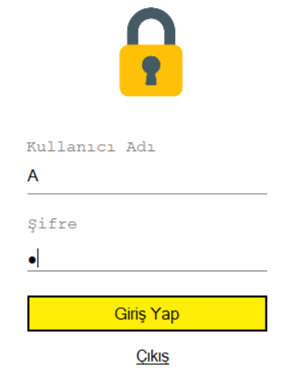
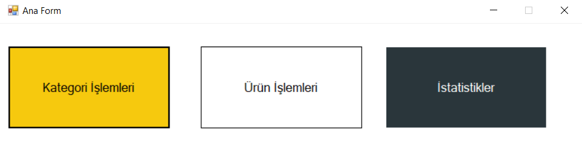
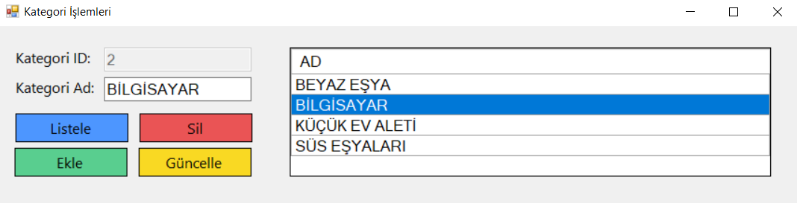
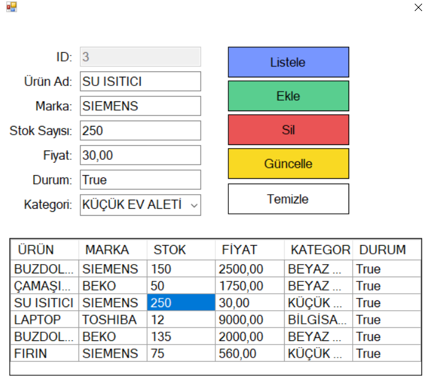
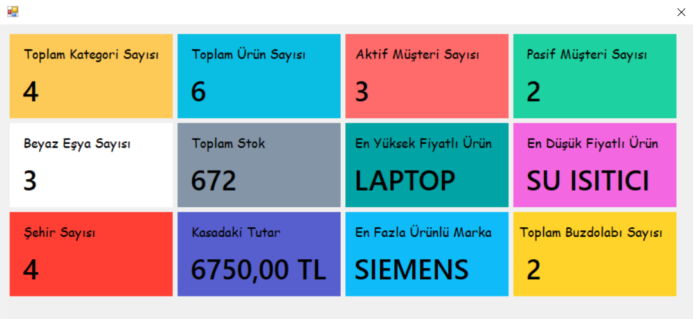

# STOK YÖNETİM SİSTEMİ
## Özet

C# ve Entity Framework kullanılarak yazılmış bir stok yönetim sistemi projesi.

## Sistemin Çalışması
### Giriş Ekranı

 Bu ekran üzerinden kullanıcı adı ve şifre girerek sisteme giriş yapabiliriz. 

## Ana Pencere

 Bu pencereden kategori işlemleri, ürün işlemleri veya istatistikler ekranına geçiş yapabiliriz. 

## Kategori İşlemleri Penceresi

 Bu pencereden var olan kategorileri listeleyebilir, kategori ekleme,silme güncelleme işlemleri gerçekleştirebiliriz. 

## Ürün İşlemleri Penceresi 

 Bu pencereden var olan ürünleri listeleyebilir, ürün ekleme,silme güncelleme işlemleri gerçekleştirebiliriz. 

## İstatistikler Penceresi

 Bu pencereden stokta mevcut olan ürünlerle ilgili istatistikleri görüntüleyebiliriz. 

